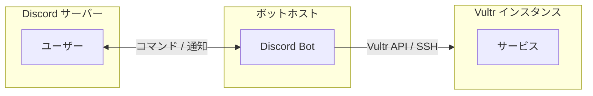

# Vultr Discord Bot

Discord から Vultr VPS インスタンスを起動/停止できるボット。スナップショット機能を使って VPS のコストを節約できます。

## 用語

このドキュメントでは以下の用語を使用します：

| 用語 | 説明 |
|------|------|
| **Discord サーバー** | Discord のコミュニティ |
| **Vultr インスタンス** | Vultr 上の VPS |
| **サービス** | Vultr インスタンス内で動作するアプリケーション（Minecraft 等） |
| **ボットホスト** | このボットが動作するマシン |



## 機能

- `/server start <name>` - スナップショットから Vultr インスタンスを起動し、IP アドレスを通知
- `/server stop <name>` - Vultr インスタンスをスナップショット化して削除（データの自動バックアップ対応）
- `/server status [name]` - Vultr インスタンスの状態を確認
- `/server list` - 登録済みインスタンス一覧を表示
- `/server files <name>` - 保存済みバックアップファイル一覧を表示

## セットアップ

### 1. 必要なもの

- Node.js 18+
- Discord Bot Token
- Vultr API Key

### 2. Discord Bot の作成

1. [Discord Developer Portal](https://discord.com/developers/applications) でアプリケーションを作成
2. Bot を追加し、Token を取得
3. OAuth2 > URL Generator で `bot` と `applications.commands` スコープを選択
4. 生成された URL でボットを Discord サーバーに招待

### 3. Vultr API Key の取得

1. [Vultr API Settings](https://my.vultr.com/settings/#settingsapi) で API Key を生成
2. Access Control で IP を許可

### 4. インストール

```bash
npm install
cp .env.example .env
cp servers.example.json servers.json
```

### 5. 環境変数の設定

`.env` ファイルを編集:

```
DISCORD_TOKEN=your_discord_bot_token
DISCORD_CLIENT_ID=your_discord_client_id
DISCORD_GUILD_ID=                        # 空欄でグローバルコマンド（全 Discord サーバー対応）
VULTR_API_KEY=your_vultr_api_key
SNAPSHOT_RETENTION=3
ALLOWED_ROLE_NAME=Server Manager         # このロールを持つユーザーのみ操作可能

# ファイルバックアップ機能（オプション）
SSH_PRIVATE_KEY_PATH=/home/user/.ssh/id_rsa
FILE_SERVER_PORT=8080
FILE_SERVER_BASE_URL=https://example.com/files
FILE_DOWNLOAD_DIR=/path/to/downloads
FILE_RETENTION=3
```

| 変数 | 説明 |
|------|------|
| `DISCORD_GUILD_ID` | 特定 Discord サーバー専用にする場合は ID を指定、空欄で全サーバー対応 |
| `ALLOWED_ROLE_NAME` | コマンド実行に必要なロール名（空欄で制限なし） |
| `SSH_PRIVATE_KEY_PATH` | SSH 秘密鍵のパス（ファイルバックアップ機能用） |
| `FILE_SERVER_PORT` | ファイル配信サーバーのポート |
| `FILE_SERVER_BASE_URL` | ファイルダウンロード用の公開 URL |
| `FILE_DOWNLOAD_DIR` | ダウンロードしたファイルの保存先 |
| `FILE_RETENTION` | 保持するバックアップファイル数（デフォルト: 3） |

### 6. インスタンス設定

`servers.json` を編集して管理する Vultr インスタンスを定義:

```json
{
  "servers": {
    "minecraft": {
      "label": "Minecraft Server",
      "region": "nrt",
      "plan": "vc2-2c-4gb",
      "snapshotPrefix": "minecraft-",
      "description": "Minecraft Java Edition Server",
      "allowedGuilds": ["123456789012345678"],
      "sshUser": "root",
      "stopCommand": "systemctl stop minecraft",
      "startCommand": "systemctl start minecraft",
      "downloadableFiles": {
        "world": {
          "path": "/opt/minecraft/world",
          "description": "ワールドデータ",
          "type": "directory"
        }
      }
    }
  }
}
```

#### 基本設定

| 項目 | 説明 |
|------|------|
| `label` | Vultr インスタンスのラベル（これで識別） |
| `region` | リージョン ID（nrt = 東京） |
| `plan` | プラン ID |
| `snapshotPrefix` | スナップショット名の接頭辞 |
| `allowedGuilds` | 操作を許可する Discord サーバーの ID 配列（空配列で全サーバー許可） |

#### ファイルバックアップ設定（オプション）

| 項目 | 説明 |
|------|------|
| `sshUser` | SSH 接続ユーザー名 |
| `stopCommand` | サービス停止コマンド |
| `startCommand` | サービス起動コマンド |
| `downloadableFiles` | ダウンロードするファイル/ディレクトリの設定 |

#### downloadableFiles の設定

```json
"downloadableFiles": {
  "キー名": {
    "path": "/path/to/file/or/directory",
    "description": "説明",
    "type": "file"  // または "directory"
  }
}
```

- `type: "file"` - 単一ファイルをダウンロード
- `type: "directory"` - ディレクトリを zip 圧縮してダウンロード

### 7. 初回スナップショットについて

Vultr インスタンスが既に起動中の場合は、`/server stop` コマンドで自動的にスナップショットが作成されるため、手動での作成は不要です。

スナップショットがない状態で `/server start` を使いたい場合のみ、Vultr コンソールから手動でスナップショットを作成してください。スナップショット名は `snapshotPrefix` で始まる名前にしてください（例: `minecraft-initial`）。

### 8. コマンド登録

```bash
npm run register
```

### 9. 起動

```bash
# 開発用
npm run dev

# 本番用
npm run build
npm start
```

### 10. デーモン化（オプション）

systemd でサービスとして常駐させる場合:

```bash
# サービスファイルをコピー
sudo cp vultr-discord-bot.service /etc/systemd/system/

# サービスファイル内のパスを環境に合わせて編集
sudo nano /etc/systemd/system/vultr-discord-bot.service

# 有効化と起動
sudo systemctl daemon-reload
sudo systemctl enable vultr-discord-bot
sudo systemctl start vultr-discord-bot

# ログ確認
journalctl -u vultr-discord-bot -f
```

## リージョン ID 一覧

| ID | 場所 |
|----|------|
| nrt | 東京 |
| icn | ソウル |
| sgp | シンガポール |
| lax | ロサンゼルス |

## プラン ID 例

| ID | スペック |
|----|----------|
| vc2-1c-1gb | 1 vCPU, 1GB RAM |
| vc2-1c-2gb | 1 vCPU, 2GB RAM |
| vc2-2c-4gb | 2 vCPU, 4GB RAM |
| vc2-4c-8gb | 4 vCPU, 8GB RAM |

詳細は [Vultr API](https://www.vultr.com/api/#operation/list-plans) を参照。

## リマインダー機能

Vultr インスタンスの消し忘れ防止のため、指定時刻にインスタンスが稼働中であれば通知します。

`.env` に以下を設定:
```
REMINDER_TIME=12:00
REMINDER_CHANNEL_ID=チャンネルID
```

- `REMINDER_TIME`: 通知時刻（HH:MM形式）
- `REMINDER_CHANNEL_ID`: 通知先チャンネルID（空欄で無効）

## ファイルバックアップ機能

`/server stop` 実行時に、サービスのデータを自動的にバックアップします。

### 動作フロー

1. サービス停止（`stopCommand` 実行）
2. 設定されたファイル/ディレクトリを SFTP でダウンロード
3. ダウンロード URL を Discord に通知
4. サービス再起動（`startCommand` 実行）
5. スナップショット作成 → Vultr インスタンス削除

### nginx 設定例

ダウンロードファイルを HTTPS で配信するための nginx 設定:

```nginx
server {
    listen 443 ssl;
    server_name files.example.com;

    ssl_certificate /path/to/cert.pem;
    ssl_certificate_key /path/to/key.pem;

    location /files/ {
        proxy_pass http://localhost:8080/files/;
        proxy_set_header Host $host;
        proxy_set_header X-Real-IP $remote_addr;
        proxy_set_header X-Forwarded-For $proxy_add_x_forwarded_for;
        proxy_set_header X-Forwarded-Proto $scheme;
    }
}
```

### 必要条件

- Vultr インスタンスに SSH 公開鍵が登録されていること
- SSH 秘密鍵のパーミッションが `600` であること
- Vultr インスタンスに `zip` コマンドがインストールされていること（directory タイプの場合）

## 注意事項

- スナップショット作成には数分かかります
- Vultr インスタンス起動後、IP 取得まで 1-2 分待機します
- 古いスナップショットは自動的に削除されます（デフォルト: 最新 3 個保持）
- グローバルコマンドの反映には最大 1 時間かかります
- 複数の Discord サーバーで使用する場合は、各サーバーで `ALLOWED_ROLE_NAME` と同じ名前のロールを作成してください
- SSH 秘密鍵のパーミッションは `chmod 600` で設定してください
